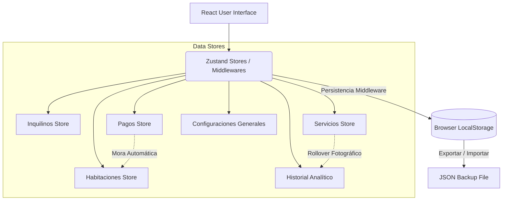
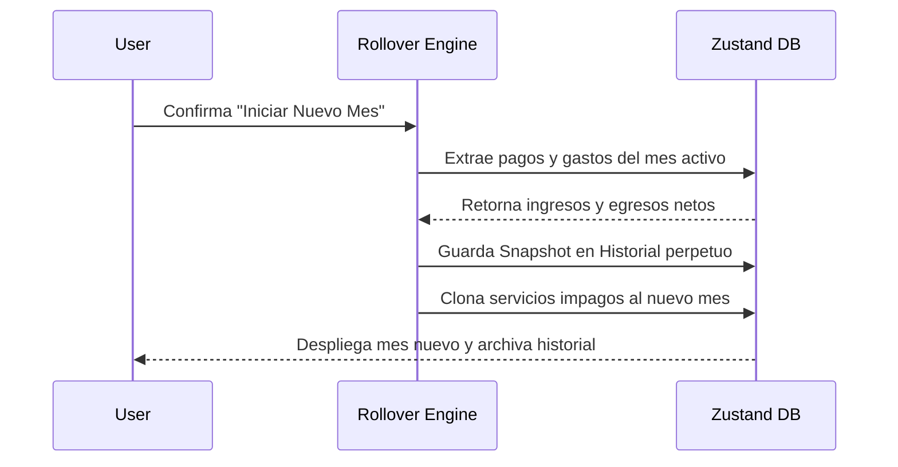
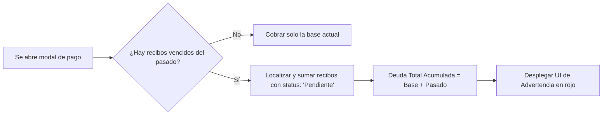

# RentApp - Property Management Dashboard


**RentApp** es una aplicación React de arquitectura *Client-Side* (Local-First) diseñada para propietarios e inversionistas inmobiliarios. Permite gestionar inquilinos, monitorear el pago de servicios públicos y llevar un control analítico de la salud financiera de la propiedad mes a mes, garantizando un 100% de privacidad de datos sin depender de servidores externos.

## 🚀 Características Principales (Features)

- **Analítica Financiera (MoM):** Gráficos interactivos de múltiples áreas (`Recharts`) que rastrean las tendencias de consumo (Gas, Agua, Internet). Incluye insignias automáticas que calculan la diferencia porcentual mes a mes (*Month-Over-Month*).
- **Motor de Cierre Financiero (Rollover):** Transiciones de mes seguras y semi-automáticas. Toma *"Snapshots"* (fotografías financieras) del mes saliente y clona recibos o deudas pendientes hacia el nuevo mes sin sobreescribir el historial.
- **Rastreo Inteligente de Deudas:** Si un inquilino no paga o un servicio se vence, el sistema acumula dinámicamente el saldo arrastrándolo a la facturación del mes actual.
- **Cumplimiento Legal Automático:** Módulo de ajuste anual de cánones de arrendamiento que calcula los incrementos automáticos basados en la tasa de inflación gubernamental (IPC).
- **Privacidad "Local-First":** Todo el ecosistema de datos persiste en el `localStorage` del navegador mediante `Zustand`. La sincronización cruzada se realiza vía copias de seguridad portátiles cifradas en formato JSON.
- **UX Premium & Mobile-First:** Diseñado con micro-interacciones (`Framer Motion`), "glassmorphism", soporte para temas oscuros/claros y una barra de navegación táctil optimizada para teléfonos móviles.

---

## 🧠 Arquitectura del Sistema

RentApp implementa un patrón de gestión de estados globales fuertemente segmentado por dominios lógicos de negocio.



---

## ⚙️ Flujos de Trabajo Centrales

### 1. Transición de Cierre Mensual (Rollover Engine)
La aplicación intercepta los cambios de calendario mediante la fecha de la zona horaria del cliente (`getLocalMonthStr()`) e invita al usuario a iniciar un cierre de mes estructurado.



### 2. Motor de Acumulación de Deuda
En lugar de triplicar registros en base de datos, RentApp deduce las deudas pasadas calculándolas "al vuelo" de forma iterativa y segura.



---

## 🛠️ Stack Tecnológico

- **Framework Core:** React 18
- **Construcción & Hot Reload:** Vite
- **Gestión de Estado:** Zustand (Persist middleware)
- **Enrutamiento:** React Router DOM v6
- **Estilos:** TailwindCSS + Variables HSL (Soporte nativo Dark Mode)
- **Visualización de Datos:** Recharts
- **Micro-Animaciones:** Framer Motion
- **Utilidades de Fecha:** date-fns
- **Iconografía:** Lucide React

---

## 💻 Instalación y Uso Local

Para correr este proyecto en modo desarrollo en tu máquina:

1. **Clona el repositorio:**
   ```bash
   git clone https://github.com/tu-usuario/rentapp.git
   ```
2. **Instala las dependencias:**
   ```bash
   cd rentapp
   npm install
   ```
3. **Arranca el servidor local:**
   ```bash
   npm run dev
   ```
4. **Construye la versión de Producción:**
   ```bash
   npm run build
   ```

---
*Arquitectura y desarrollo optimizado para entornos de Alta Privacidad (SaaS Local).*
